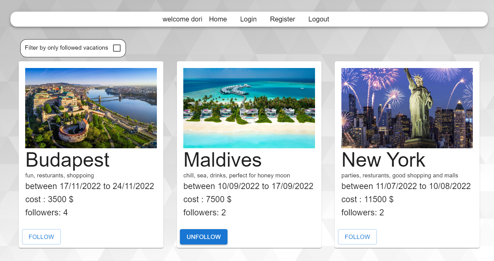
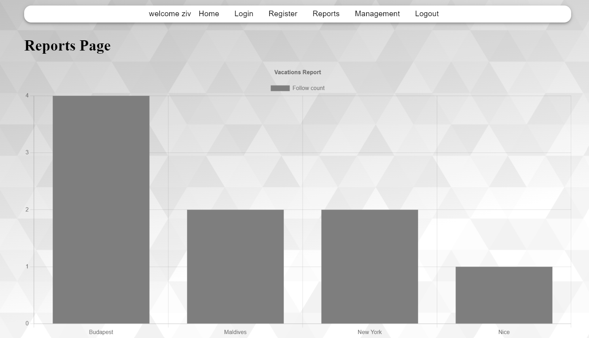
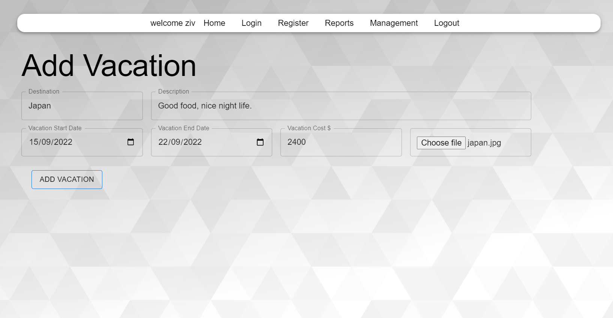

# Project Title

Vacations Feed

## Description

On the site, you can follow your favorite vacations and watch them.<br>
You also can see which destination has the most followers from all the site users!<br>
As an admin you can add vacations to the list and also to have a live report on the vacations followers count. 
<br><br>
Technologies I used in my project: React, Node.JS, MySQL, Docker.

## Images

  


## Getting Started

### Dependencies

* NodeJS, Docker

### Installing

git clone my reposetory to your local folder.

### Executing program

* Open the terminal and run the following commands:
```
cd dev-apps
docker compose up
```
* Open new terminal and run the following commands:
```
cd apps\api
npm install
npm run all-slim
```
* Open another new terminal and run the following commands:
```
cd apps\client
npm install
npm start
```

## Help

If you running into a docker problem, check if the port 3306 of MySQL is available.
```
cd dev-apps
docker compose down 
```
after you make sure the port is available, run the following command in the dev-apps folder: 
```
cd dev-apps
docker compose up 
```

## Authors

Ziv Ashkenazi 
[@Linkdin](https://www.linkedin.com/in/ziv-ashkenazi/)
